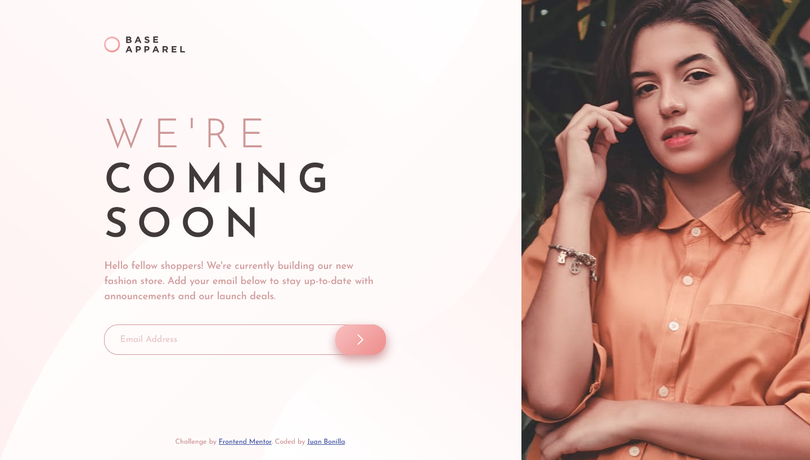

# Frontend Mentor - Base Apparel coming soon page solution

This is a solution to the [Base Apparel coming soon page challenge on Frontend Mentor](https://www.frontendmentor.io/challenges/base-apparel-coming-soon-page-5d46b47f8db8a7063f9331a0). Frontend Mentor challenges help you improve your coding skills by building realistic projects! 

## Table of contents

- [Overview](#overview)
  - [The challenge](#the-challenge)
  - [Screenshot](#screenshot)
  - [Links](#links)
- [My process](#my-process)
  - [Built with](#built-with)
  - [What I learned](#what-i-learned)
  - [Continued development](#continued-development)
  - [Useful resources](#useful-resources)
- [Author](#author)

## Overview

### The challenge

Users should be able to:

- View the optimal layout for the site depending on their device's screen size
- See hover states for all interactive elements on the page
- Receive an error message when the `form` is submitted if:
  - The `input` field is empty
  - The email address is not formatted correctly

### Screenshot

Desktop view



### Links

- Solution URL: [Click here](https://www.frontendmentor.io/solutions/mobilefirst-site-html-scss-js--TeyMFcgx)
- Live Site URL: [See live site here](https://juanbonilla.me/FEM_base-apparel-coming-soon/)

## My process

### Built with

- Semantic HTML5 markup
- CSS / SCSS custom properties
- Flexbox
- CSS Grid
- Mobile-first workflow

### What I learned

I learned to use the add and remove function of the ClassList property inside a DOM Element. This was useful to know when I tried to validate the form submit event. So, everytime the user clicks the button and the email is invalid the error styles will be there until the email is valid.

### Continued development

I want to improve my understanding of the picture tag and the image attributes, such as the ```srcset```, due to the importance that generates its funtionality. I get how important could be to display different images based on the viewport size, even though I still want to search for use cases related to this scenario.

### Useful resources

- [Img Attributes](https://htmlreference.io/element/img/) - This helped me to understand how can I use specific HTML image attributes to display an image according to the viewport size.
- [Form validation](https://developer.mozilla.org/es/docs/Learn/Forms/Form_validation) - This article guided me through the implementation of form validation.
- [Email RegEx](https://stackoverflow.com/questions/201323/how-to-validate-an-email-address-using-a-regular-expression) - When I was testing the email field, I found a case when the email was not valid but my form allowed it. So, I investigated for a regular expression that validates any kind of email address correcting the default validation.

## Author

- Website - [juanbonilla.me](https://juanbonilla.me)
- Frontend Mentor - [@juanpb96](https://www.frontendmentor.io/profile/juanpb96)
- LinkedIn - [Juan Bonilla](https://www.linkedin.com/in/juan-pablo-bonilla-6b8730115/)
